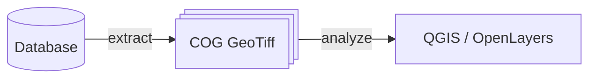

# Privacy-aware and time-based heatmaps

## POC / R&D

This is a Proof Of Concept.

In this repository we investigate the creation of heatmaps from a great number of linestrings.

We are specifically interested in:
- privacy: making it hard to identify a particular track;
- time-series: observing evolution with time or other parameter;
- client-side analysis: dynamic coloring, local querying, cloud optimizations.

## Architecture / technical stack

We have selected the python ecosystem for its completness and ease of use.

In a first step, on the backend side, we generate geotiffs, where each pixel contains the number of linestrings that passes through it.
In a second step, on the client side, we view / colorize / analyze the data.

We use COG Geotiffs to allow partial retrieval and rendering of the data.
We use compression to greatly reduce the size of the images.

## Generating COG Geotiffs

The linestrings are extracted from a PostgreSQL DB and drawn to one or a series of GeoTiffs.
It requires the `CONNINFO` environment variable to be set.
Edit and run [./generate_heat.py].

Make sure to use the ['./make_private.py'] tool to discard the pixels without enough data.

## Coloring / analyzing

A QGIS project is available to directly insect the data. Use `qgis visualization.qgs`.

Alternatively, an OpenLayers application is available in ['./olview']. It can be run using:
`cd olview; npm i; npm start` and `browse http://localhost:5173/`. In this webapp a slider allows to select the minimum count a pixel should have to be visible.

## Technical findings

It is effectively possible to create GeoTiffs at the Swiss level and display them efficiently, directly in the browser.
A non-compressed Geotiff with pixels of 100mx100m is ~32MB, independently of its content. With compressing it can be much 5x-10x less and only a small porition can be retrieved thanks to COG.

## Next?

To go further we need actual data.
I have contacted the Camptocamp.org organization to access their GPX traces.

Do you have data and would like to apply these techniques?
Or maybe you have some feedback?
Just let me know.